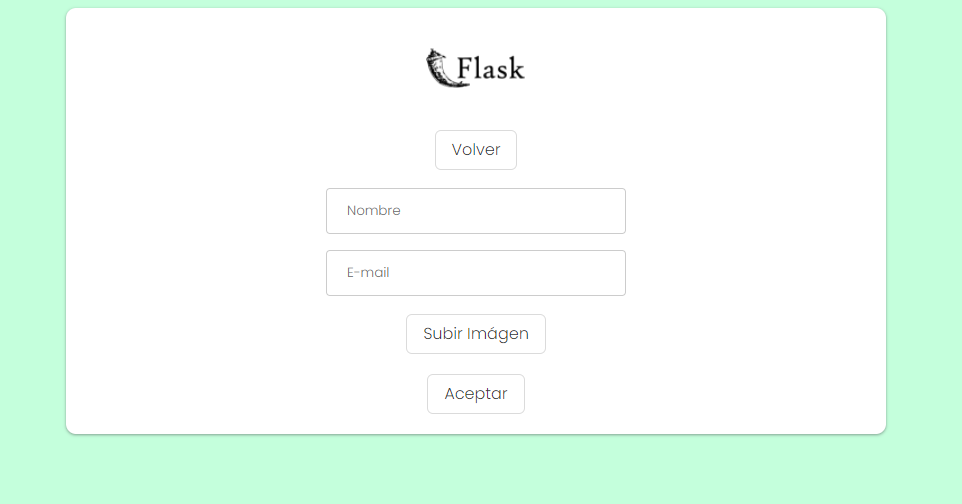

# Python 🐍 | Flask 🧪 | MySQL 💻

Super simple setup to get started using Python & Flask.

## Screenshots



## Setup

We'll need a database, I'm using Xampp for Windows, it's easier to create one. It has phpMyAdminwhich allows to create a database from localhost/phpmyadmin. (Probably you've done this a thousand times, I know).
So, database name: pythoncrud; and then create the columns as follows:


- Install Flask from terminal:

```
pip install flask
```
- Install Flask MySQL:

```
pip install Flask-MySQL
```
- Install jinja2, for working with the template:

```
pip install jinja2
```
- Check for correct installation of everything:

```
pip list
```

- Change connection settings if necessary:
```
mysql = MySQL()
app.config['MYSQL_DATABASE_HOST'] = 'localhost'
app.config['MYSQL_DATABASE_USER'] = 'root'
app.config['MYSQL_DATABASE_PASSWORD'] = ''
app.config['MYSQL_DATABASE_DB'] = 'personas'
mysql.init_app(app)
```

- Run the app:
```
python app.py
```

Best wishes to you! 🤗